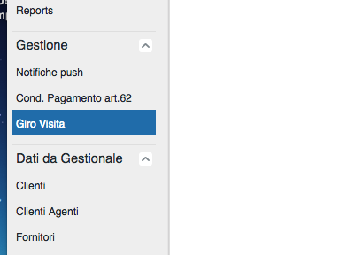
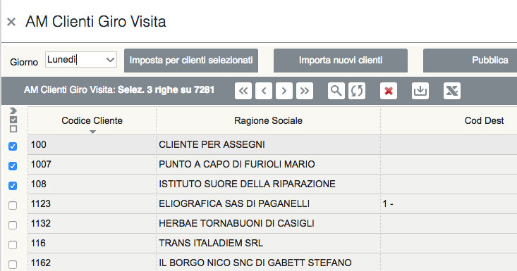

Girovisita
===========

All'interno dell'AppManager è possibile definire una pianificazione settimanale delle visite che ogni agente possono fare sui propri clienti.
La funzione è contenuta all'interno del menu Gestione di AppManager.

   
Import dei nuovi clienti
~~~~~~~~~~~~~~~~~~~~~~~~
Ad una prima apertura, inizialmente si presenta come una maschera vuota.
Per aggiungere i clienti su cui pianificare i giorni della settimana, premere il pulsante **Importa nuovi clienti**.
Questa funzione preleva i dati dell'ultima estrazione dei clienti fatta dal gestionale e li inserisce in una apposita anagrafica statica (che non viene cioè cancellata o caricata dai tracciati di estrazione).
A questo punto nella maschera compariranno tutti i clienti.

.. warning:: L'utilizzo del modulo Girovisita è disponibile solo con specifica licenza

Impostazione del giorno della settimana
~~~~~~~~~~~~~~~~~~~~~~~~~~~~~~~~~~~~~~~
Sui clienti recuperati, specificare il giorno della settimana in cui si desidera effettuare la visita.
Ricordarsi di salvare i dati con l'apposito pulsante situato nella toolbar della maschera.
E' anche possibile impostare un giorno su una selezione massiva di righe.

   
Per farlo operare come segue:

1. Mettere la maschera in modalità di ricerca (icona con lente di ingrandimento nella toolbar)
2. Impostare un filtro (ad esempio selezionando un agente)
3. Recuperare i dati cliccando sull'apposito pulsante della toolbar (icona con lente di ingrandimento su righe nella toolbar)
4. Selezionare le righe in cui si desidera impostare giorno della settimana (es: Lunedì) come giorno di visita.
   Per farlo cliccare sui checkbox a sinistra della riga
5. In alto, nella maschera, selezionare il giorno che si desidera impostare in maniera massiva sulla selezione effettuata.
6. Cliccare il pulsante **Imposta** per i clienti selezionati
7. Cliccare il pulsante **Pubblica** per rendere definitive le modifiche

Invio dati all'iPad
~~~~~~~~~~~~~~~~~~~
Quando si clicca il pulsante **Pubblica**, i dati diventano disponibili per la prossima sincronizzazione degli iPad.
Quando i dati del Girovisita sono presenti, la maschera di ricerca che si apre all'agente in fase di inserimento dell'ordine, mostra subito i dati raggruppati per giorno della settimana.

