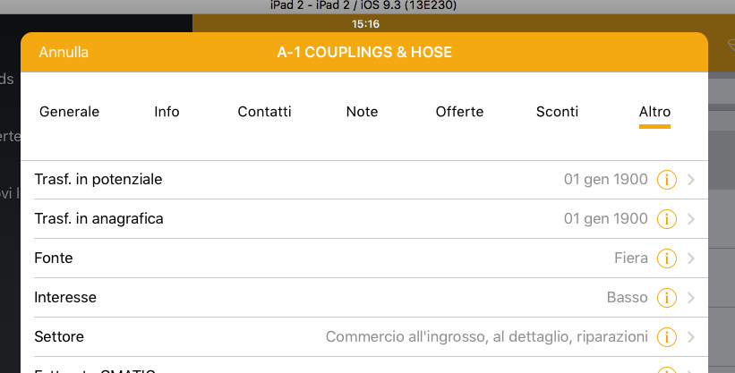

Esportare dati personalizzati
=============================

Esiste un particolare tracciato, chiamato io_custom_fields.dat, che consente di aggiungere dati personalizzati in alcuni punti  applicativi predefiniti.
Tali dati vengono visualizzati, nell'iPad, in un specifica scheda che appare in vari punti del programma con il nome Altro.

Il tracciato io_custom_fields.dat deve essere creato secondo le specifiche descritte in :doc:`int-export-dati`, e deve essere composto dai seguenti campi:

==================  ==================
Nome del campo      Descrizione
==================  ==================
CHIAVE              Valore univoco identificativo della riga (Non sono ammessi duplicati)
COD_DITTA           Codice della ditta
NOME                Nome della label
VALORE              Valore della label
TIPO                Impostare sempre a 1 (NON USATO
CHIAVE_PADRE        Impostare sempre a 1 (NON USATO)
CONTESTO            Contesto del dato (es: clienti, fornitori, ecc..)
COD_EXT             Campo di collegamento con il contesto (es: codice articolo, codice cliente, ecc..)
VISUAL_MASK         Posto in viene visualizzato il dato
POSIZIONE_VALORE    Impostare sempre a 1 (NON USATO)
ORDINAMENTO         Valore numerico che determina la sequenza di visualizzazione del dato (es: 1)
POSIZIONE_NOME      Impostare sempre a 0 (NON USATO)
TIPO_DATO           Tipo di dato (es: 0 = String, 1 = Integer, ecc..)  
DAT_ULT_MOD         Data di ultimo aggiornamento del dato (si vedao specifiche generali)
==================  ===========

Vediamo ora nel dettaglio il significato di ogni campo.

Etichetta e valore del dato
--------------------------- 
Il campo NOME deve sempre contenere il valore alfanumerico che si desidera mostrare come descrizione della label del campo personalizzato.
Il campo VALORE invece, deve contenere il valore da mostrare a destra della label

Tipologia del dato
------------------
Il campo TIPO_DATO, deve indicare il tipo di dato che si sta aggiungendo.

Può assumere i seguenti valori:

======  ==========
Valore  Tipo
=====   ==========
0       String
1       Date
2       Datatime
3       Integer
4       Decimal
=====   ==========

Contesto di visualizzazione
---------------------------
Il campo CONTESTO determina il contesto del dato e quindi il luogo in cui i dati devono comparire. I valori possibili sono:

=========  =============================
Valore     Contesto di visualizzazione
=========  =============================
clienti    Visibile in Modulo Clienti
fornitori  Visibile in modulo Fornitori
prodotti   Visibile in Modulo Prodotti
leads      Visibile in Modulo Leads
=========  =============================  

Per fare un esempio, se il tracciato contenesse il valore clienti in questo campo, il dato personalizzato verrebbe mostrato nella scheda Altro, in fondo a destra fra i dettagli della scheda clienti.

Il successivo campo VIS_MASK determina se la visualizzazione deve avvenire solo nel modulo schede, solo nel modulo ordini o in una combinazione dei 2 moduli.

Alcuni esempi:

========  =======================================================================
CONTESTO  Luogo in cui viene mostrato
========  =======================================================================
clienti   Modulo SCHEDE o ORDINI (dipende da VIS_MASK), Sottomodulo CLIENTI
leads     Modulo LEADS (dipende da VIS_MASK), Sottomodulo LEADS
========  =======================================================================

External code
-------------
Il campo COD_EXT (codice esterno) rappresenta il vero e proprio collegamento fra il campo personalizzato e il dato anagrafico a cui esso afferisce, quindi:

- Nel caso in cui il contesto è clienti, COD_EXT deve contenere il codice cliente
- Nel caso in cui il contesto è fornitori, COD_EXT deve contenere il codice fornitore
- Nel caso in cui il contesto è prodotti, COD_EXT deve contenere il codice del prodotto
- Nel caso in cui il contesto è leads, COD_EXT deve contenere il codice del leads

Modulo in cui visualizzare i dati (VISUAL_MASK)
-----------------------------------------------
Identifica il modulo in cui si dedidera mostrare i dati. Per specificare tale valore, si deve utilizzare una stringa di bit in cui ogni bit indica il modulo in cui il dato deve apparire.

La maschera di bit è la seguente:

::

  +----->   posizione 2 - Modulo Crm
  | +---->  posizione 1 - Modulo Ordini
  | | +---> posizione 0 - Modulo Schede
  | | |
  x x x

Esempi:

========  ============================================
VIS_MASK  Modulo in cui viene mostrata la scheda Altro
========  ============================================
100       CRM
001       SCHEDE
011       SCHEDE e ORDINI
101       CRM e SCHEDE
========  ============================================

