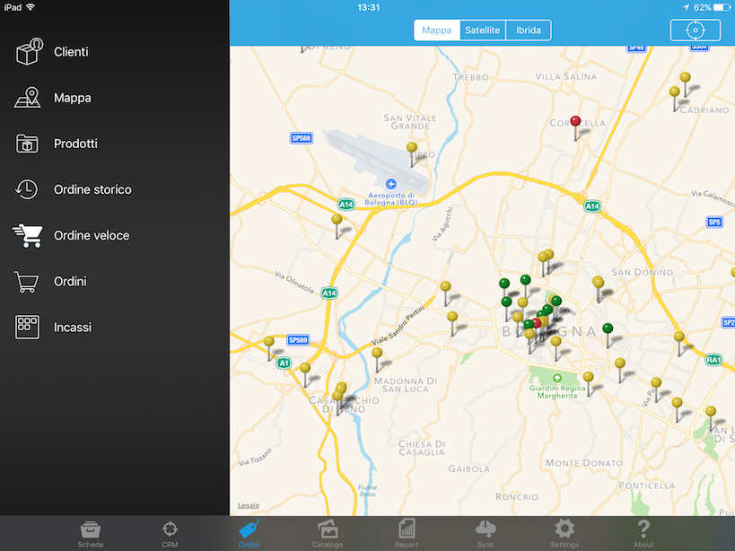

Mappa clienti
=============

La mappa clienti mostra la posizione geografica dei clienti attraverso il posizionamento di un segnalino (pin).
Tale posizione viene determinata in base alle coordinate definite sul tracciato io_clifor_gen.dat.

Il pin che indica la posizione può assumere 3 diverse colorazioni:

1. Giallo: Il cliente non effetta ordini da oltre 4 mesi
2. Rosso: Il cliente ha scadenze non pagate
3. Verde: Tutti gli altri casi

Quando più pin sono geograficamente vicini, viene mostrata una icona nera con un numero che indica il numero di clienti situati nella zona. Questa modalità di visualizzazione si chiama clustering.

Il livello di raggruppamento dei pin sulla mappa, in base ad un potenzialmente elevato numero di cliente, può determinare un sensibile decremento delle prestazioni.
Per questo motivo, nella sezione ```Setting``` dell' iPad è possibile modificare il livello di raggruppamento.


   
   
Mancata visualizzazione dei pin
--------

La visualizzazione dei pin dei clienti sulla mappa dipende dai seguenti fattori:

1. Le coordinate geografiche devono essere esportate. Verificare che nel tracciato dei clienti siano valorizzati i campi latitudine e longitudine

2. La geolocalizzazione dell'iPad deve essere attiva. Verificare che sia attiva l' impostazione in :

::

  Impostazioni / Privacy / Localizzazione / [nome-app] / Mentre usi l'App

3. Il raggio di visualizzazione dei clienti deve essere sufficientemente grande.
Nelle impostazioni dell' applicazione c'è una opzione che ampia il raggio di visualizzazione dei pin nella mappa.
Potrebbe accadere che i pin dei clienti siano fuori del raggio di visualizzazione.
Agire su questa impostazione per modificare il raggio di visualizzazione.
