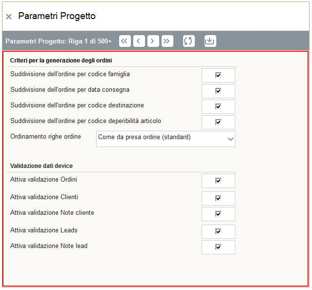

Parametri AppManager
===================


   
Split degli ordini
~~~~~~~~~~~~~~~~~~

Sotto il menu Anagrafiche / Parametri, è presente una videata in cui è possibile impostare:

1. Suddivisione dell'ordine per codice famiglia
2. Suddivisione dell'ordine per data consegna
3. Suddivisione dell'ordine per codice destinazione
4. Suddivisione dell'ordine per codice deperibilità articolo

Queste 4 opzioni possono essere configurate a piacimento per determinare in che modo
gli acquisti effettuati dagli agenti devono essere raggruppati o suddivisi).

La Raccolta ordini su iCommerce è concepita per raccogliere gli ordini in una modalità simile a quella di un sito di e-commerce.
Di fatto, l'agente raccoglie una lista di articoli che ha venduto ma non sa
o comunque può non dover sapere come questa lista deve comporre l'ordine.

Agendo su questi flag, la lista di articoli venduti viene raggruppata in base alle impostazioni effettuate.
Immaginiamo per esmepio, di aver attivato il flag di suddivisione per "data di consegna".
L'agente prende gli ordini su 4 articoli ma in uno di questi imposta una data di consegna diversa.
In questo caso AppManager crea 2 ordini. Uno con i primi 3 articoli e uno con quello con data consegna differente.

Ordinamento righe ordine
~~~~~~~~~~~~~~~~~~~~~~~
L'opzione ```Ordinamento righe`` consente di modificare l'ordinamento delle righe ordine inserite sui dispositivi.
L'ordinamento può essere configurato nel seguente modo:

- In base all'inserimento originale (Come da presa ordine)
- Ordinamento per descrizione


Validazione dati device
~~~~~~~~~~~~~~~~~~~~~~~

I dati che un utente può modificare sull'ipad sono:

1. Ordini
2. Clienti
3. Note dei clienti
4. Leads
5. Note dei leads

Per ognuna di queste categorie, è possibile attivare la validazione utente.

Tale impostazione blocca di fatto l'esportazione del dato per il gestionale fino a quando un operatore "manualmente" non 
effettua la validazione.

Con questa funzione è possibile, per esempio, fare in modo che gli ordini, prima di essere acquisiti,
debbano essere verificati da un operatore.


