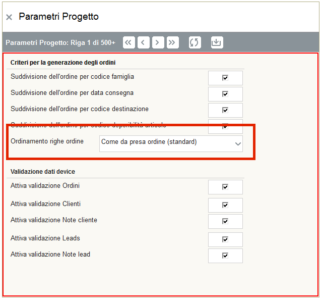

rel. 6.11 - 01/11/2016
=====================

Novità
------
**Ordinamento righe ordine configurabile - (rif: nd)**

E' stata introdotta la possibilità di configurare l'ordinamento delle righe ordine.
Questa opzione è disponibile nel menu di parametri di AppManager.

   
   
Attualmente l'ordinamento può essere configurato nel seguente modo:

- In base all'inserimento originale (Come da presa ordine)
- Ordinamento per descrizione

